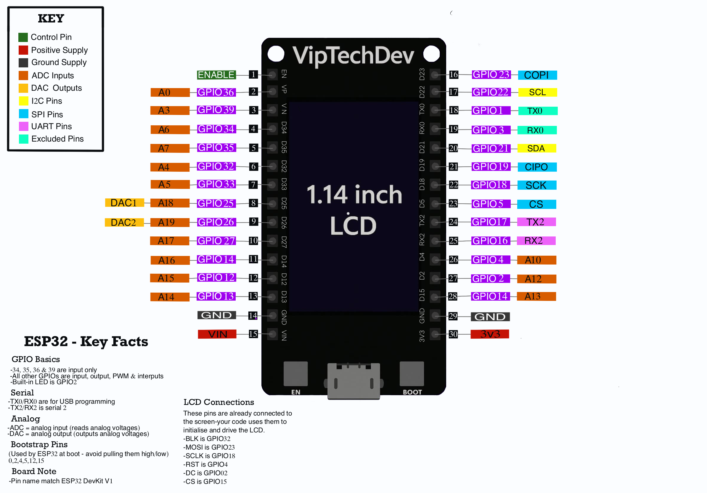
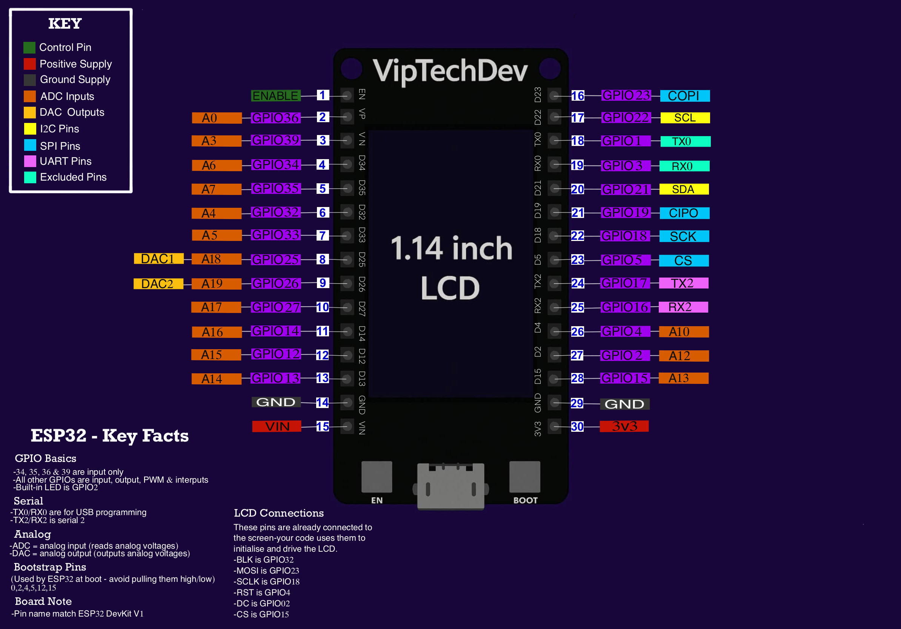

# Ideaspark ESP32 1.14" LCD Development Board  
*A VipTechDev‑curated module for makers, tinkerers, and product builders.*

The Ideaspark ESP32 LCD board is a compact, powerful development module featuring an ESP32 microcontroller and a bright 1.14" ST7789 display. This repository provides everything you need to get started using **Visual Studio Code + PlatformIO**, including setup instructions, example projects, animations, and a friendly quick‑start guide.

---

## ⭐ Features
- ESP32 dual‑core microcontroller  
- 1.14" 240×135 ST7789 IPS LCD  
- USB‑C or Micro‑USB (depending on batch)  
- CH340 USB‑serial interface  
- On‑board backlight control pin  
- Breadboard‑friendly layout  
- Fully tested in the UK by VipTechDev  

---

## 📐 Pinout Diagram




---

## 📦 What’s in this Repository
- **Quick Start Guide** (PlatformIO‑focused setup)  
- **Example PlatformIO projects**  
  - 01-SimpleText  
  - 02-Shapes  
  - 07-DemoAll
  - and many more examples
  
The examples are numbered from simple to advanced, so beginners can follow them in order.
    
- **Pinout reference**  
- **Links to drivers and libraries**

For detailed usage instructions and example explanations, see:

👉 **[`lib/IdeasparkLCD/README.md`](lib/IdeasparkLCD/README.md)**

---

## 🛠️ Getting Started with PlatformIO

### 1. Install Visual Studio Code  
Download from: https://code.visualstudio.com/

### 2. Install PlatformIO Extension  
In VS Code:  
**Extensions → Search “PlatformIO IDE” → Install**

### 3. Install CH340 Driver  
Your computer needs this to talk to the board.  
Search for: [CH340 driver](https://www.google.com/search?q=CH340+driver) 
Install the version for your OS.

### 4. Create a New PlatformIO Project  
- Click the **PlatformIO Home** icon  
- Choose **New Project**  
- Name: `ideaspark-esp32-lcd`  
- Board: **ESP32 Dev Module**  
- Framework: **Arduino**  
- Finish

PlatformIO will generate a full project structure for you.

---

## 📚 Add Required Libraries

Open `platformio.ini` and add:

```ini
lib_deps =
    adafruit/Adafruit ST7735 and ST7789 Library
    adafruit/Adafruit GFX Library
```

PlatformIO will automatically install dependencies like Adafruit seesaw.

---

## 🧩 Arduino IDE Support (Optional)

This repository includes a small set of Arduino‑IDE‑compatible examples for users who prefer the Arduino workflow.  
You can find them here:

👉 **[Arduino Examples](examples/Arduino/README.md)**

These sketches use the standard **Adafruit GFX** and **Adafruit ST7789** libraries and mirror the behaviour of the PlatformIO examples.

---

### ⚙️ Personal note from the developer

My preferred development environment is **PlatformIO**, which I use for all my own projects.  
It offers a cleaner project structure, automatic library management, and a more scalable workflow — especially when working with multiple boards or more advanced firmware.

Because of that, I have **less day‑to‑day experience with the Arduino IDE**, and the Arduino examples provided here are intentionally simple.  
They’re designed to help beginners get started quickly, but PlatformIO remains the recommended environment for anything beyond basic experimentation.

If you're new to development, I encourage you to try the PlatformIO examples first — they’re better organised and easier to extend into real projects.

---

## 🔌 Pinout Overview

| Function      | ESP32 Pin |
|---------------|-----------|
| LCD MOSI      | 23        |
| LCD SCLK      | 18        |
| LCD CS        | 15        |
| LCD DC        | 2         |
| LCD RST       | 4         |
| LCD Backlight | 32        |

---

## 🧪 Example: Hello VipTechDev

Create or edit the file at:  
`src/main.cpp`

```cpp
#include <Arduino.h>
#include <Adafruit_GFX.h>
#include <Adafruit_ST7789.h>

#define LCD_MOSI 23
#define LCD_SCLK 18
#define LCD_CS   15
#define LCD_DC   2
#define LCD_RST  4
#define LCD_BLK  32

Adafruit_ST7789 lcd = Adafruit_ST7789(LCD_CS, LCD_DC, LCD_RST);

void setup() {
    pinMode(LCD_BLK, OUTPUT);
    digitalWrite(LCD_BLK, HIGH); // turn on backlight

    lcd.init(135, 240);
    lcd.fillScreen(ST77XX_BLACK);
}

void loop() {
    lcd.setTextSize(3);
    lcd.setCursor(10, 10);
    lcd.print("Hello, VipTechDev!");
    delay(100000);
}
```

---

## 🧰 PlatformIO Build & Upload

### Build:
```
PlatformIO: Build (checkmark icon)
```

### Upload:
```
PlatformIO: Upload (right‑arrow icon)
```

### Serial Monitor:
```
PlatformIO: Monitor (plug icon)
```

---

## 🧩 Troubleshooting

### Screen shows random static on power‑up  
This is normal before initialization. The examples include backlight‑control code to hide it.

### Board not detected  
Install the CH340 driver.

### Display stays white  
Check wiring and ensure the correct pins are defined.

### Upload errors  
Try lowering upload speed in `platformio.ini`:
```ini
upload_speed = 115200
```

---

## 🏷️ License
MIT License — feel free to build on this, modify it, and use it in your own projects.

---

## 📬 Support
If you need help, want to report an issue, or have ideas to improve the project, please open an issue on the GitHub repository.

---

## 🌐 Connect with VipTechDev
Follow the project and future boards here:  
👉 **Facebook: Viptechdev – Microcontroller Projects & UK Tested Boards**  
👉 **GitHub: https://github.com/VipTechDev**

